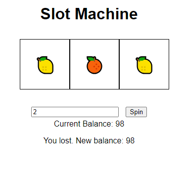

<!-- 
1) Define constants
 1.1 symbols for slots

2) Define required variables used to track the state of the game
 2.1 Players starting cash 

3) Add event listeners
 3.1 check if the wager entered is valid
 3.2 spin button

5) Handle a player clicking spin with valid wager
 5.1 add for loop with math logic for random spin
 5.2 Update players money to wager based on win / loss
 5.3 Return message if player does not have enough to wager with 

6) Handle win / loss logic 
 6.1 Add a multiplier for winning
 6.2 add reset button if the player is out of money
  -->

  